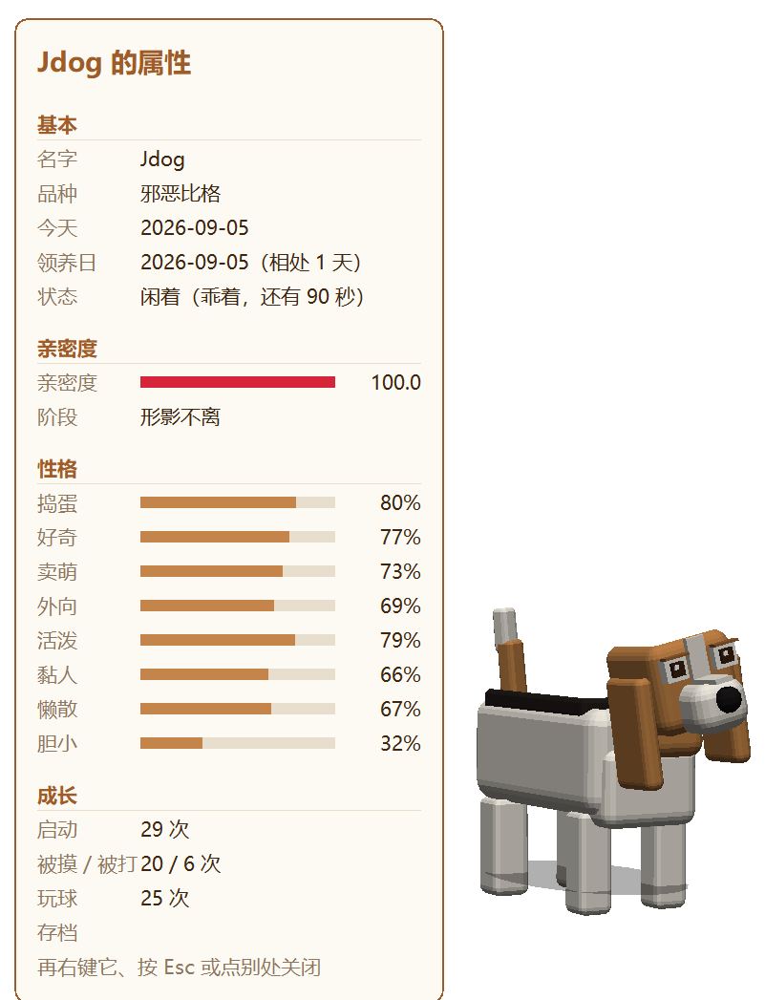

# CyberDog

**下载：[最新版 exe（Releases）](https://github.com/danielli28ita/CyberDog/releases/latest)** —— 单个文件，双击即用，Windows 10/11，不用安装。

**Download: [latest exe (Releases)](https://github.com/danielli28ita/CyberDog/releases/latest)** — one file, double-click to run, Windows 10/11, nothing to install.

<p align="center">

</p>

一条住在 Windows 任务栏上的 3D 比格犬。它站在任务栏上，后腿被任务栏挡住、前腿踩在任务栏前面，像趴在栏杆上。默认待在屏幕右下角，不打扰你干活。

A 3D beagle that lives on the Windows taskbar. Its hind legs are hidden behind the taskbar and its front paws rest on it, like a dog leaning on a railing. It stays in the bottom-right corner by default and keeps out of your way.

## 1.1 有什么新的

## What’s new in 1.1

- 最大化普通窗口时不再把狗藏掉；只有独占全屏 / 投影才会隐藏。

  No longer hides when you only maximize a normal window; only exclusive fullscreen / presentation mode hides it.

- 可以把狗拖到扩展显示器，位置会记住。

  Drag it onto an extended monitor; the spot is remembered across restarts.

- 启动优先读 exe 旁边的存档；没有存档时可选新建或从别的文件夹导入。

  Prefers save data next to the exe; if none is found, you can create a new dog or import from another folder.

## 1.2 有什么新的

## What’s new in 1.2

- 每条狗的基础性格由种子随机展开（邪恶比格基线上偏移），属性面板有一句性格摘要。

  Each dog gets a random base personality (evil-beagle baseline + seed offset) with a short summary in the stats panel.

- 亲密度变成等级经验（Lv.1–10 + 档名 + 本级进度条）；摸涨比打掉容易，长时间不理也会慢慢掉一点。

  Affinity is now a level/XP track (Lv.1–10); petting raises it faster than hitting or long idle lowers it.

## 1.3 有什么新的

## What’s new in 1.3

- 托盘菜单「性格…」可拖滑条改八维，或点「重新随机」再摇一套；确定后立刻生效并写入存档。

  Tray menu "Personality…" lets you edit the eight traits with sliders, or tap "Reroll" for a new draw; OK applies and saves at once.

旧版 [1.0](https://github.com/danielli28ita/CyberDog/releases/tag/v1.0) / [1.1](https://github.com/danielli28ita/CyberDog/releases/tag/v1.1) / [1.2](https://github.com/danielli28ita/CyberDog/releases/tag/v1.2) 仍可下载（有则保留）。

Older releases stay available when published.

## 它会做什么

## What it does

- **自己过日子**：发呆、伸懒腰、抖毛、坐下、卖萌、闲逛、玩网球、扑光标、打翻食盆、冲向屏幕、趴下睡觉（睡觉时跳上垫子，打轻轻的呼噜）。

  **Lives its own life**: idles, stretches, shakes, sits, acts cute, wanders, plays with a tennis ball, pounces on the cursor, flips its bowl, charges the screen, lies down to sleep (on a cushion, with a quiet snore).

- **有性格**：每条狗领养时随机生成一套性格，动作偏好不一样；亲密度和它当下的需求也会影响它选什么做。

  **Has a personality**: each dog gets a random personality when adopted; affinity and current needs also shape what it chooses to do.

- **有眼神**：光标靠近时盯着你看，平时东张西望、斜眼、眨眼。

  **Looks around**: stares at the cursor when it is near, otherwise glances about, side-eyes and blinks.

- **会叫**：叫声、哼唧、喘气、闻东西都是真实录音；22:00–08:00 自动静音，捣蛋的声音每小时有上限。

  **Makes sounds**: barks, whimpers, panting and sniffing are real recordings; silent 22:00–08:00, mischief sounds are rate-limited.

- **不添乱**：没人理它时自动缩小到 55%；别的程序全屏时自动隐藏；锁屏时暂停；换显示器或改缩放会自己重启。

  **Stays out of the way**: shrinks to 55% when ignored, hides under full-screen apps, pauses on lock screen, restarts itself when displays or scaling change.

- **管你健康**：每 30 分钟提醒喝水、起身活动一次（两项错开），离开电脑时暂停。

  **Looks after you**: reminds you to drink water and stand up every 30 minutes (staggered), paused while you are away.

- **记事**：托盘菜单里写备忘和时间，到点它跑到屏幕中间叫两声、举气泡提醒你；戳一下算看过。

  **Keeps notes**: write a note and a time in the tray menu; when due it runs to the middle, barks twice and shows a bubble. Poke it to acknowledge.

- **报天气**：在托盘里填一个城市（支持全球任意城市，同名时优先中国和欧洲），启动时报一句当天天气。不填就完全不联网。

  **Reports the weather**: set a city in the tray menu (any city worldwide; ties prefer China and Europe) and it announces today's weather at launch. No city, no network at all.

- **教你玩**：偶尔冒一条操作提示；很久没摸它，会提醒你摸头能加亲密度。

  **Teaches you**: occasional usage tips; if you have not petted it for a while it reminds you that petting raises affinity.

## 怎么和它互动

## How to interact

| 操作 | 效果 |
|---|---|
| 光标在它头上慢慢移动 | 摸头：冒红心，亲密度上升（每分钟有上限），它会乖一段时间 |
| 光标在它头上快速来回 | 打它：亲密度下降（很难掉），它缩起来哼唧 |
| 左键点一下 | 戳它：亲密度小幅上升；备忘提醒时点一下表示「看到了」 |
| 左键按住身体拖动 | 搬家：松手的位置就是它新的常驻位置；拖到任务栏附近会自动贴回去 |
| 右键点它 | 打开 / 关闭属性面板：名字、性格、亲密度等级、领养天数、各种计数 |
| 点或拖过它之后 60 秒内 | 它才会离开角落到处逛、玩球、闹腾；之后回到角落只做原地动作 |

| Input | Effect |
|---|---|
| Move the cursor slowly over its head | Petting: hearts appear, affinity rises (capped per minute), it behaves for a while |
| Move the cursor quickly back and forth over its head | Hitting: affinity drops a little, it cowers and whimpers |
| Left-click | Poke: small affinity gain; during a note reminder it means "seen" |
| Hold the left button on its body and drag | Move house: the release point becomes its new home; near the taskbar it snaps back onto it |
| Right-click it | Toggle the stats panel: name, personality, affinity level, days adopted, counters |
| Within 60 s after a click or drag | Only then will it leave the corner to wander, play ball or misbehave; afterwards it goes back and does in-place actions |

托盘图标右键菜单：改名、声音开关、备忘录、天气城市、语言（中文 / English / Italiano）、打开数据目录、退出。

Tray icon menu: rename, sound on/off, notes, weather city, language (中文 / English / Italiano), open data folder, quit.

## 数据放在哪

## Where the data lives

启动时优先用 exe 旁边的 `CyberDog-data\`。没有 `cyberdog.ini`（或旧名 `jdog.ini`）时会问你：新建一条狗、从其他文件夹导入、或取消退出。程序目录不可写时，新建/导入会退到 `%LOCALAPPDATA%\CyberDog\`。里面主要是：

On launch it prefers `CyberDog-data\` next to the exe. If there is no `cyberdog.ini` (or legacy `jdog.ini`), it asks: create a new dog, import from another folder, or cancel. If the program folder is not writable, create/import falls back to `%LOCALAPPDATA%\CyberDog\`. Main files:

- `cyberdog.ini`：名字、性格、亲密度、设置、常驻位置、计数，不到 1 KB。

  Name, personality, affinity, settings, home position, counters. Under 1 KB.

- `plugin.memo.txt`：备忘录，看过且过期一周的自动清掉。

  Notes; seen notes older than a week are pruned.

没有日志文件。删掉整个文件夹再启动，等于重新选新建或导入。

No log files. Delete the folder and relaunch to choose create or import again.

## 自己编译

## Build it yourself

需要 Visual Studio 2022 和 Windows SDK。

Visual Studio 2022 and the Windows SDK.

```powershell
cmake -S . -B build -G "Visual Studio 17 2022" -A x64
cmake --build build --config Release
```

产物是 `build\bin\Release\CyberDog.exe`，单文件静态链接。C++20，Win32 + Direct3D 12 + DirectComposition。

Output is `build\bin\Release\CyberDog.exe`, a single statically linked file. C++20, Win32 + Direct3D 12 + DirectComposition.

代码分三层：`core\` 是与平台无关的狗本身（动作、性格、亲密度、手势、眼神、模型、存档、多语言），`overlay\` 是 Windows 上的窗口、渲染、托盘、音频，`plugins\` 是天气、备忘、健康提醒、操作提示四个插件。`tests\` 是核心层的回归用例。

Three layers: `core\` is the platform-independent dog (actions, personality, affinity, gestures, gaze, model, save, i18n), `overlay\` is the Windows side (window, rendering, tray, audio), `plugins\` holds the weather, notes, health and tips plugins. `tests\` has the regression tests for the core layer.

## 许可证

## License

MIT，见 `LICENSE`。天气数据来自 [Open-Meteo](https://open-meteo.com/)，地名来自 [OpenStreetMap Nominatim](https://nominatim.org/)。叫声录音来自 CC0 素材库，见 `overlay/res/sounds/CREDITS.txt`。

MIT, see `LICENSE`. Weather from [Open-Meteo](https://open-meteo.com/), place names from [OpenStreetMap Nominatim](https://nominatim.org/). Dog sounds are CC0 recordings, see `overlay/res/sounds/CREDITS.txt`.
